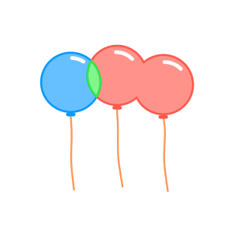
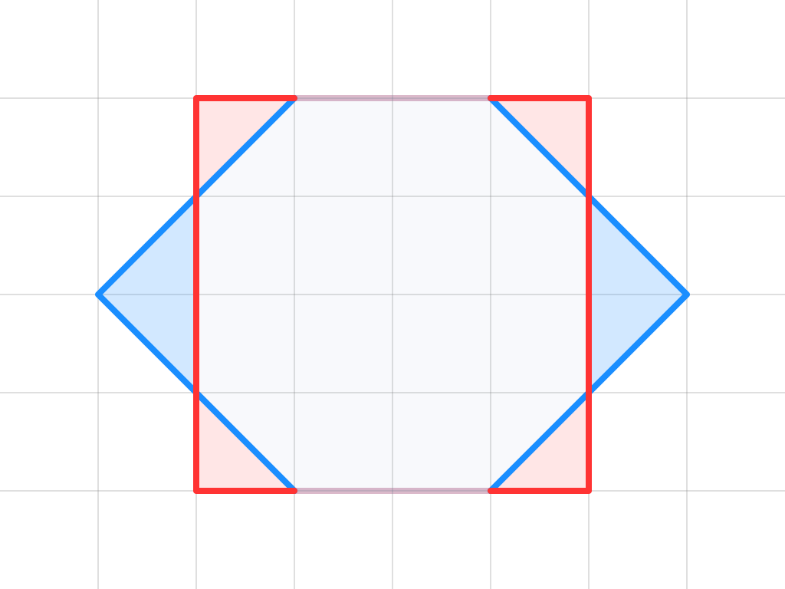

# iOverlay


The iOverlay is a fast poly-bool library supporting main operations like union, intersection, difference, and xor, governed by either the even-odd or non-zero rule. This algorithm is based on Vatti clipping ideas but is an original implementation.


## [Documentation](https://ishape-rust.github.io/iShape-js/overlay/stars_demo.html)
Try out iOverlay with an interactive demo:

- [Stars Rotation](https://ishape-rust.github.io/iShape-js/overlay/stars_demo.html)
- [Shapes Editor](https://ishape-rust.github.io/iShape-js/overlay/shapes_editor.html)


## Features

- **Operations**: union, intersection, difference, and exclusion.
- **Polygons**: with holes, self-intersections, and multiple paths.
- **Simplification**: removes degenerate vertices and merges collinear edges.
- **Fill Rules**: even-odd and non-zero.

## Getting Started

Add the following to your Cargo.toml:
```
[dependencies]
i_float = "^1.0.0"
i_overlay = "^1.0.0"
```

### Hello world

Let's union two squares
```rust
let subj = [
    F64Point::new(-10.0, -10.0),
    F64Point::new(-10.0, 10.0),
    F64Point::new(10.0, 10.0),
    F64Point::new(10.0, -10.0),
];

let clip = [
    F64Point::new(-5.0, -5.0),
    F64Point::new(-5.0, 15.0),
    F64Point::new(15.0, 15.0),
    F64Point::new(15.0, -5.0),
];

let mut overlay = FloatOverlay::new();

overlay.add_path(&subj, ShapeType::Subject);
overlay.add_path(&clip, ShapeType::Clip);
let graph = overlay.build_graph(FillRule::NonZero);

let shapes = graph.extract_shapes(OverlayRule::Union);

println!("shapes count: {}", shapes.len());

if shapes.len() > 0 {
    let contour = &shapes[0][0];
    println!("shape 0 contour: ");
    for p in contour {
        let x = p.x;
        let y = p.y;
        println!("({}, {})", x, y);
    }
}
```

# Overlay Rules

## Union, A or B


## Intersection, A and B


## Difference, B - A


## Exclusion, A xor B

